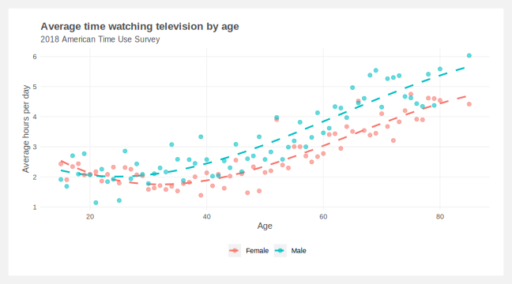
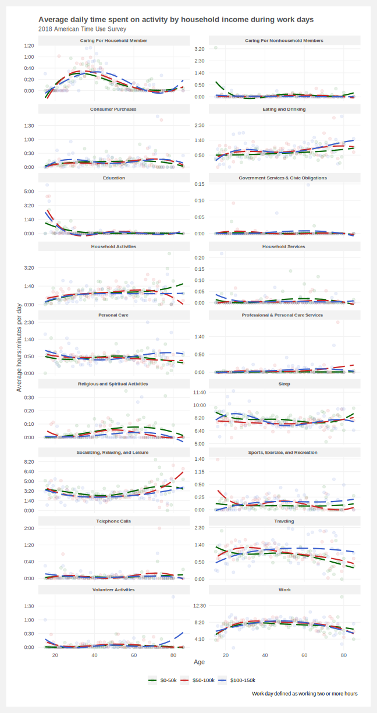
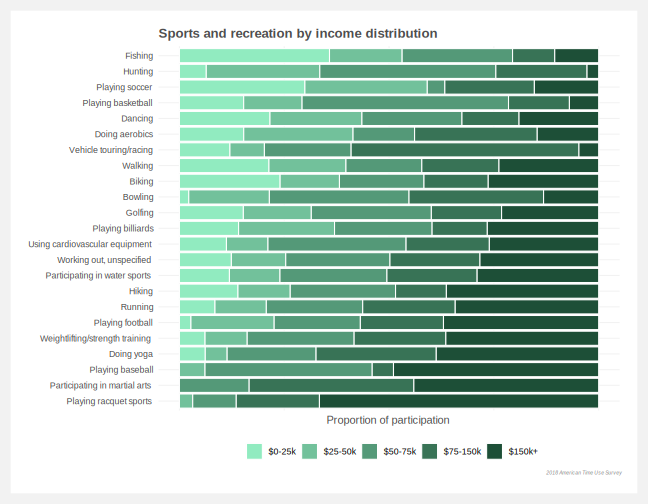
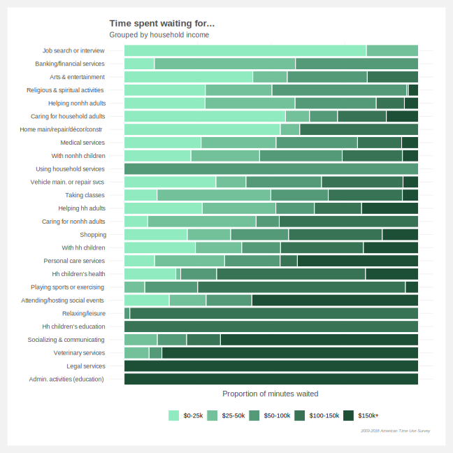

# ATUS
Analysis of the [American Time Use Survey](https://www.bls.gov/tus/)

## To-do list

#### Data search and programming
- [x] Find the right data
- [X] Consolidate similar features
- [ ] Double check specific activities are categorized correctly (e.g. travel should not include commuting)
- [x] Pull out sleep from Personal Care
- [x] Integrate multi-year data

#### Trend explorations
- [x] Summarize of activities by age
- [x] Summarize of activities by age and working status
- [ ] What activities are more indicative of income
- [ ] Do higher income people work more or less
- [ ] Waiting associated with working / Waiting associated with work-related activities
- [ ] Work, other job(s)
- [x] Rank sports by income
- [x] Waiting by income
- [x] Security related to attending sporting events / Security procedures rel. to arts & entertainment
- [x] Houseplants
- [x] Time spent job searching
- [x] Leisure by region
- [x] Computer use

#### Markov chain simulation
- [ ] Build matrix of probabilities

 

