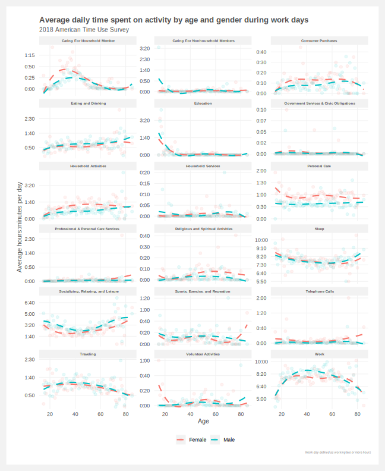

# ATUS
Analysis of the [American Time Use Survey](https://www.bls.gov/tus/)

## To-do list
- [x] Find the right data
- [X] Consoldiated the features
- [x] Summarize of activities by age
- [x] Summarize of activities by age and working status
- [ ] Double check specific activities are categorized correctly (e.g. travel should not include commuting)
- [x] Pull out sleep from Personal Care
- [ ] Explore trends by income
  - What activities are more indicative of income
  - Do higher income people work more or less

 

