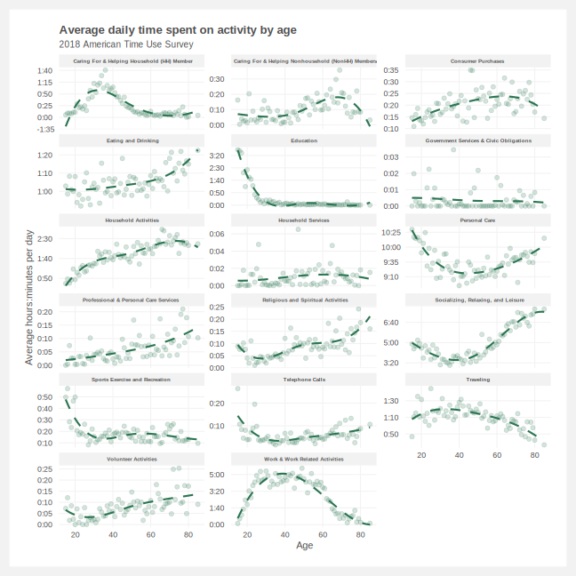
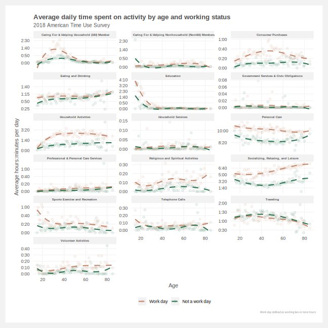
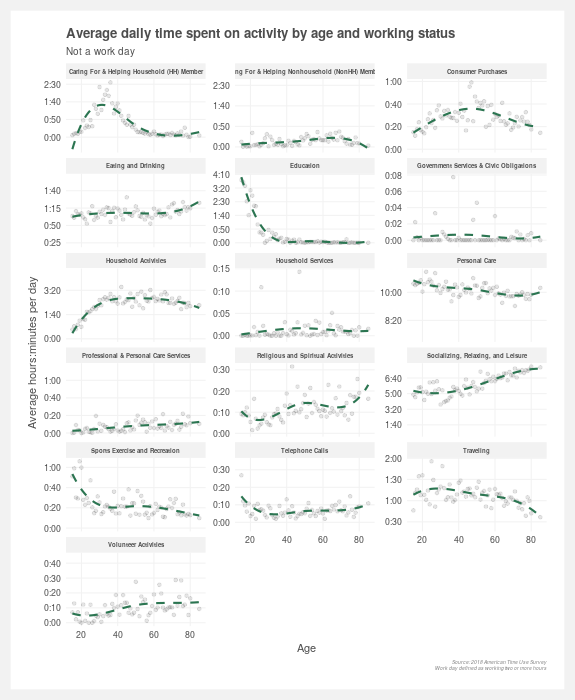

# ATUS
Analysis of American Time Use Survey 

## To-do list
- [x] Find the right data
- [X] Consoldiated the features
- [x] Summarize of activities by age
- [x] Summarize of activities by age and working status
- [ ] Double check specific activities are categorized correctly (e.g. travel should not include commuting)
- [ ] Pull out sleep from Personal Care
- [ ] Explore trends by income

 

